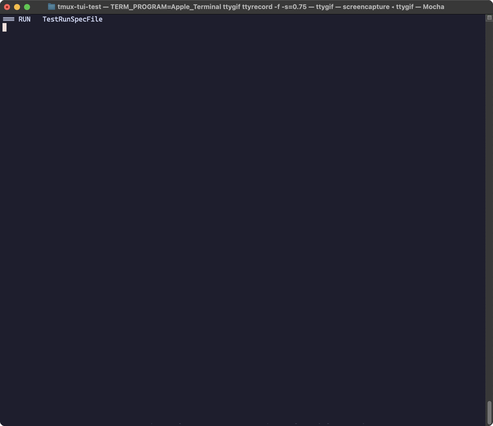

# tmux-tui-testing


tmux-tui-testing is a Go testing framework designed for automating tests within a `tmux` session. It enables automated execution of test specifications by simulating user interactions with terminal programs inside `tmux`.

### Why tmux-tui-testing?

`tmux-tui-testing` is designed to address the challenges of testing terminal-based applications, particularly CLIs with complex interactions.
Traditional testing methods often fall short when it comes to simulating real user interactions in a terminal environment.
With this framework, you can perform end-to-end tests that simulate real user behavior inside a tmux session, such as executing commands, handling interactive prompts, or verifying terminal output.
This is especially useful for testing CLIs that involve multiple steps, a real TTY or depend on terminal-specific behaviors.

## Features

- Automates testing of terminal-based applications.
- Uses `tmux` to create, manage, and destroy test sessions.
- Supports test specifications defined in `.ttt` files.
- Provides utilities for executing single test files and directories of test specifications.


## Requirements

- [tmux](https://github.com/tmux/tmux) must be installed.
- Go 1.23.4+

## Installation

```sh
go get github.com/SirMoM/tmux-tui-testing
```

## Usage

### Test Specification Format
A `.ttt` file defines steps in this format:
- `# <name>`: Defines the name of the Test.
- `% <rootProgram>`: Start a root / parent program. It is recommended to use a shell and define a prompt (e.g. `% PS1="$ " sh`).
- `> "<command>" <confirmationKey> <timeoutInMs>`: Send input to the shell (e.g., `> "echo Hello" enter 0`).
  - Confirmation Key Options are:
    - `enter`: Sends an `Enter` key press
    - `tab`: Sends a `Tab` key press
    - `none`: No key press is sent
- Expected output is matched verbatim after each command.

#### Example Test

A `.ttt` test specification defines a sequence of terminal commands and expected outputs.


[Example](./examples/minimal.ttt):
```
#Minimal Test
% PS1="" sh
> "echo 'Hello World'" enter 0
> "ls" enter 10

Hello World
ls
example_test.go  minimal.ttt  testfiles
```

More examples can be found in the [`examples/testfiles`](./examples/testfiles) directory.

### Running a Single Test Specification

You can run a single `.ttt` test specification using:

```go
ttt.RunTestSpec("path/to/test.ttt", t)
```

### Running a Directory of Test Specifications

To execute all `.ttt` test files within a directory:

```go
ttt.RunTestSpecDir("path/to/tests", t)
```

## Testing

To run the included example test suite:

```sh
go test ./...
```

